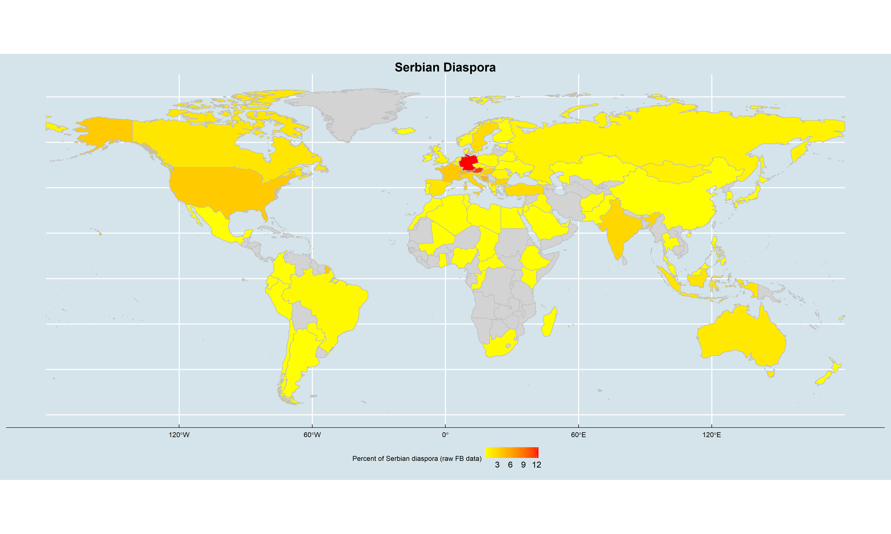
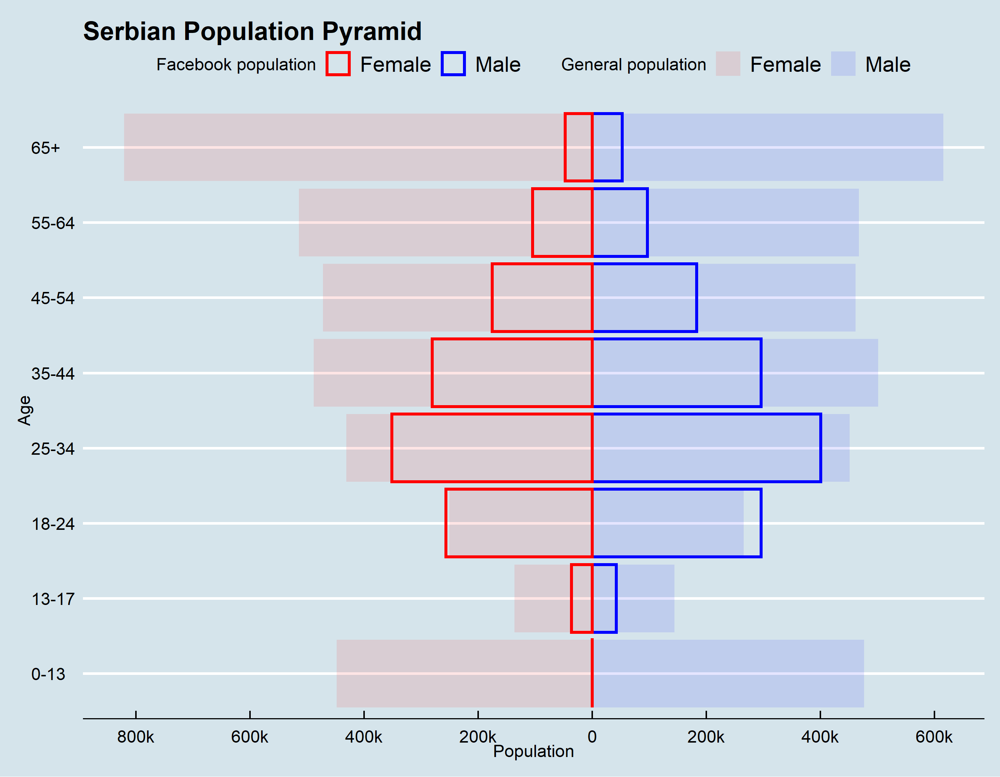

# Facebook Expats Data

#### Note: Initial results can be found in the folder *Data*
## 1. Introduction
This depository is used for building a code and downloading Facebook data that serves as an input for the analysis and visualization of Serbian emigration. This account will be handed over to the UNDP team upon the completion of the project. The purpose of using the Facebook estimations is not to reproduce migration statistics, but rather to generate snapshots of the estimates of expatriates that could be used to measure emigration trends. Estimates of social media application users who are classified as expats can be a timely, low-cost, and almost globally available source of information for estimating stocks of international migrants. Our methodology allows a low-cost and automated estimations. However, there are important methodological and data integrity issues with using social media data sources for studying migration-related phenomena. 

## 2. Facebook API and data

We use data from the Facebook advertising platform to estimate stocks of “expats” in various countries (see below for a discussion on the definition of “expat”). The Facebook
advertising platform allows advertisers to select the characteristics of their target audience, for instance, age and gender, and to obtain an estimate of the number of monthly active users of the Facebook Network (Facebook, Instagram, Messenger) who meet the selected criteria and could be reached through an advertising campaign. The frequent discrepancy between Facebook Network estimations of the number of individuals with certain characteristics living in a country and census data on the same population groups opens up questions about the reliability of Facebook estimates on the one hand, and the possible gaps in traditional statistics, on the other.

Through the Facebook’s Marketing Application Programming Interface (API), we collected data about the number of monthly active users of the Facebook Network based on the
country of their current location, their age, gender and the country of their previous residence of which they are considered as expats. The Facebook Network’s definition of expats – “People who used to live in country X who now live abroad” – is quite generic. Facebook does not disclose details about the method used for classifying users as expats.

### 2.1 Fetching the data

To connect with the API, we used python library [pySocialWatcher](https://github.com/maraujo/pySocialWatcher/blob/master/README.md).

```
@inproceedings{araujo2017facebook,
 author = {Araujo, Matheus and Mejova, Yelena and Weber, Ingmar and Benevenuto, Fabricio},
 title = {Using Facebook Ads Audiences for Global Lifestyle Disease Surveillance: Promises and Limitations},
 series = {WebSci '17},
 year = {2017},
 location = {Troy, USA},
 publisher = {ACM},
 address = {New York, NY, USA},
 keywords = {Facebook, Advertising, Epidemihology, Social Media, Health},
} 
```
**License:** MIT


##### Facebook Marketing API Refereces page:
Targeting Specs: https://developers.facebook.com/docs/marketing-api/targeting-specs/v2.8

Ad Targeting Search API: https://developers.facebook.com/docs/marketing-api/targeting-search/v2.8

#### Install
    git clone https://github.com/maraujo/pySocialWatcher.git
    cd pySocialWatcher
    pip install -r requirements.txt
    python setup.py install
    
#### Quick Start
You should have a .csv file with your Facebook tokens and accountIDs.
Example: pySocialWatcher/pysocialwatcher/facebook_tokens_example.csv
  
    >>> from pysocialwatcher import watcherAPI 
    >>> watcher = watcherAPI() 
    >>> watcher.load_credentials_file("pysocialwatcher/credentials.csv")
    >>> watcher.run_data_collection("pysocialwatcher/input_examples/quick_example.json")


#### Limitations:
Current supported API fields are listed below:
    ```
    "interests",
    "behaviors",
    "education_statuses",
    "family_statuses",
    "relationship_statuses",
    "locales",
    "genders",
    "age_min",
    "age_max",
    "geo_locations"
    ```

More information on the definition of the categories can be found here https://developers.facebook.com/docs/marketing-api/audiences/reference/advanced-targeting/.


### 2.2. Downloaded data



We analysed the characteristics of Facebook Network statistics to develop a robust model for correcting the bias given by the fact that Facebook Network users may over or under-
represent a country’s population at large. As shown in Figure 2, Facebook Network users’ representativeness varies based on the country under consideration, as well as
demographic characteristics of the population, namely gender and age. When the number of Facebook Network users in a country and a given age group is higher than the actual
number of residents in that age group (based on official statistics), it means that users have multiple unlinked Facebook Network accounts, for instance on Facebook, Instagram
and Messenger. We assume that there are two main drivers of Facebook Network platforms’ usage.



### 2.2. Calibrating the raw data

Official statistics on international migrant stocks disaggregated by age, sex, country of birth and destination were used to a) identify the degree to which a migrant assimilates to the Facebook Network usage patterns of the destination country and b) evaluate and compare the results of the model proposed. Migration statistics at this level of disaggregation are available from UNDESA (2008), the OECD in collaboration with the World Bank (2010) and Eurostat (2017a). We used Eurostat statistics since they were more
updated. We additionally used updated population statistics from UNDESA (2017a) for calibrating the Facebook Network data.

## 3. Methodology

We developed a methodology to estimate the number of individuals who fulfil specific demographic criteria based on non-representative Facebook Network statistics. For example, we want to estimate the number of individuals who are in a particular age group, are female or male, who used to live in, e.g. Germany, and who now live in another country,
e.g. France, based on the number of Facebook Network users that meet those age and gender criteria and are classified by Facebook as German expats in France. In the following
sections, we first analyse the Facebook Network data and its limitations, then we pre-assess and clean the Facebook Network statistics, and lastly, we present the model that
we developed.
