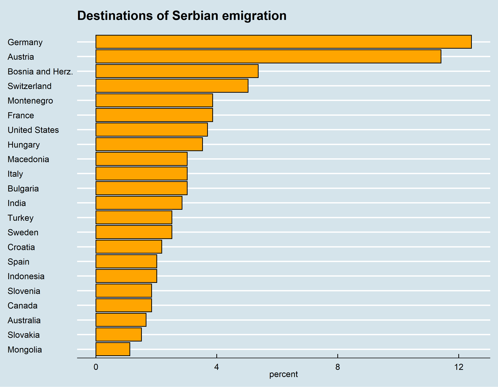

# Facebook Expats Data

## 1. Introduction
This depository is used to build the code and download Facebook data which serves as an input for the analysis and visualization of the Serbian emigration. This account will be handed over to the UNDP team upon the completion of the project. The purpose of using the Facebook estimations is not to reproduce migration statistics, but rather to generate snapshots of the estimates of expatriates that could be used to measure emigration trends. Using social media in this regard can be a timely and low-cost source of information.  Our model will fetch new data every two months, which, we hope, will give a glimpse into the cross-border movement of the Serbian population. However, there are important methodological and data integrity issues with using social media data sources that we will discuss and address.  

## 2. Facebook API and data

We use data from the Facebook API to estimate the number of Serbian “expats” in countries around the world. "Expat" is Facebook's definition of a person who lived in one country ("home country") at some point in their life, but moved to another country. "Home country" in our case is Serbia, and host countries are all coutries recognized by Facebook's API. Additionally, we added additional parameters, such as age group, education, marriage status and gender. The API returns the estimates of the number of monthly users who were active on social networks in the host country. The social networks include Facebook, Instagram, and Messenger. The estimates present a subset of the total population and need to be calibrated based on the official numbers. 


### 2.1 Fetching the data

To connect with the API, we used python library [pySocialWatcher](https://github.com/maraujo/pySocialWatcher/blob/master/README.md).

```
@inproceedings{araujo2017facebook,
 author = {Araujo, Matheus and Mejova, Yelena and Weber, Ingmar and Benevenuto, Fabricio},
 title = {Using Facebook Ads Audiences for Global Lifestyle Disease Surveillance: Promises and Limitations},
 series = {WebSci '17},
 year = {2017},
 location = {Troy, USA},
 publisher = {ACM},
 address = {New York, NY, USA},
 keywords = {Facebook, Advertising, Epidemihology, Social Media, Health},
} 
```
**License:** MIT


##### Facebook Marketing API Refereces page:
Targeting Specs: https://developers.facebook.com/docs/marketing-api/targeting-specs/v2.8

Ad Targeting Search API: https://developers.facebook.com/docs/marketing-api/targeting-search/v2.8

#### Install
    git clone https://github.com/maraujo/pySocialWatcher.git
    cd pySocialWatcher
    pip install -r requirements.txt
    python setup.py install
    
#### Quick Start
You should have a .csv file with your Facebook tokens and accountIDs.
Example: pySocialWatcher/pysocialwatcher/facebook_tokens_example.csv
  
    >>> from pysocialwatcher import watcherAPI 
    >>> watcher = watcherAPI() 
    >>> watcher.load_credentials_file("pysocialwatcher/credentials.csv")
    >>> watcher.run_data_collection("pysocialwatcher/input_examples/quick_example.json")


#### Limitations:
Current supported API fields are listed below:
    ```
    "interests",
    "behaviors",
    "education_statuses",
    "family_statuses",
    "relationship_statuses",
    "locales",
    "genders",
    "age_min",
    "age_max",
    "geo_locations"
    ```

More information on the definition of the categories can be found here https://developers.facebook.com/docs/marketing-api/audiences/reference/advanced-targeting/.


### 2.2. Downloaded data

The query returned a total of around 600 thousand monthly users who are identified as Serbian expats. The map below presents per-country breakdown of that number.


Some of the results were not expected, such as India, Indonesia and Mongolia. We will discuss these results in more detail later in the text.




We compared the age structure of the Serbian Facebook users with the official data from the Statistical Office of Serbia and found a signifficant age bias. Additionally, the number of Facebook users aged 18-24 is higher than the country's population in the same age group. The likely reason is the existence of abandoned accountrs, and/or multiple accounts per person (same person has an account of Facebook, Instagram, and Messenger). Finally, the data does not exhibit signifficant gender bias, as the ratio of female to male users is 49/51.


## 3. Methodology

Our methodology is based on the following three papers:
[Monitoring of the Venezuelan exodus through
Facebook’s advertising platform](https://journals.plos.org/plosone/article?id=10.1371/journal.pone.0229175)
[Quantifying international human mobility
patterns using Facebook Network data](https://journals.plos.org/plosone/article?id=10.1371/journal.pone.0224134)
[Migration Data using Social Media](https://ec.europa.eu/jrc/en/publication/migration-data-using-social-media-european-perspective)

The goal is to estimate the number of expats based on non-representative raw Facebook data. We propose a three-step method:

### 3.1 Analyze the robustness of Facebook data

Altough there is a large difference between the total number of estimated expats by Facebook and semi-official data on the size of Serbian diaspora, Facebook data can still be valid and useful if it proves to caputre the magnitude of emigration and the variation between different countries. In our initial analysis, we downloaded the official host-country esimtates of the Serbian population in EU countries plus Australia, Canada, Switzerland and USA. When compared with Facebook data, the two data sets share a similar spatial distribution (Pearson correlation of r = 0.91, p<0.001).

Regarding the temporal evolution of emigration, Facebook does not offer any historical data. Temporal trends can, however, be traced through repeated data collections, eventually building up a historic repository. 

### 3.2. Clean the data

Some of the initial results are surprising. The query returned a suprisingly large estimates for Serbian expats in India and Bangladesh and surprisingly low estimate for China. Other researchers noted that censoring efforts in China make it impossible to estimate expat population in that country. However, we are still looking into the numbers in India and Bangladesh. We are testing two hypotheses - first, there is a non-negligible number of Indian citizens who worked in Serbia, but moved back to their country, and second, Facebook's algorithm for identifying expats is sensitive to large host country populations.  

### 3.3 Develop a model and calibrate the data

For our model, we will use weighted regression model to find the corrected number of expats in a host country c, for age group a, and gender g, denoted by Nc(a,g,c). This number  corresponds to the "real" population of the demographic group in the host country. Nc(a,g,c) is iteratively estimated by multiplying the raw Facebook numbers Nr(a,g,c) by coefficients. The purpose of the coefficient is to correct Facebook’s over or under-representations, and is estimated

